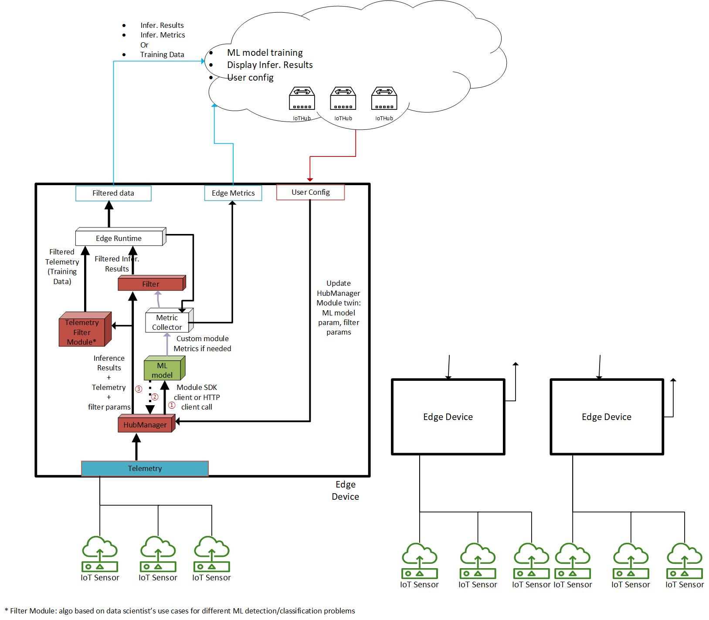

# Azure IoT Edge sample for Python

Created on Oct 2021 

Updated on Feb 2023

## Overview

This is a Machine Learning at the edge (MLADE) sample to demonstrate the process of the on-prem data collecting, filtering and uploading to the Azure Cloud for AI model training.

The process of filtering high quality training data is to iteratively live inference the collected data at the edge with the pre-trained AI model, and select the targeted data of the desired confidence level range with its inference outcomes.

## Application Use Case

The data collection filtering algorithm is to inference the collected data with the pulled pre-build AL model from ACR at the edge, with the criteria of inference result confidence level to reach the desired data quality, and send it to cloud as high quality data for ML model training. Some typical use cases could be

- Collect the specific data based on its inference performance to refine and improve AI model accuracy. For example, if the current model has a low performance on inferring the data at certain time period and gives ambiguous outcome (say, confidence level ~= 0.5), the application can select those data in such particular time and confident level range as the desired training data by live inference of it, and filter it based on its inference result before sending to the cloud. It helps to increase the weight of the concerned dataset for model refining.
- Collect the training data based on the environment conditions and data characteristics. For example, the ML Engineer only want to collect peak hour traffic data for traffic type prediction scenario, so that the training data contains intensive traffic information. Then he/she can set the desired time period, recurring, and the desired duty cycle to collect the data efficiently.
- < to be added >

[Azure IoT Python SDK v2](https://github.com/Azure/azure-iot-sdk-python) is in use.

## Architecture

The solution flowchart:

The sequence diagram for the filter module as below is used to illustrate the message communication flow:

